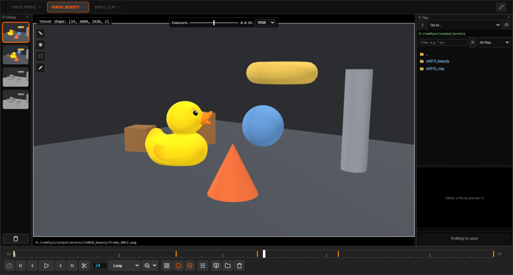
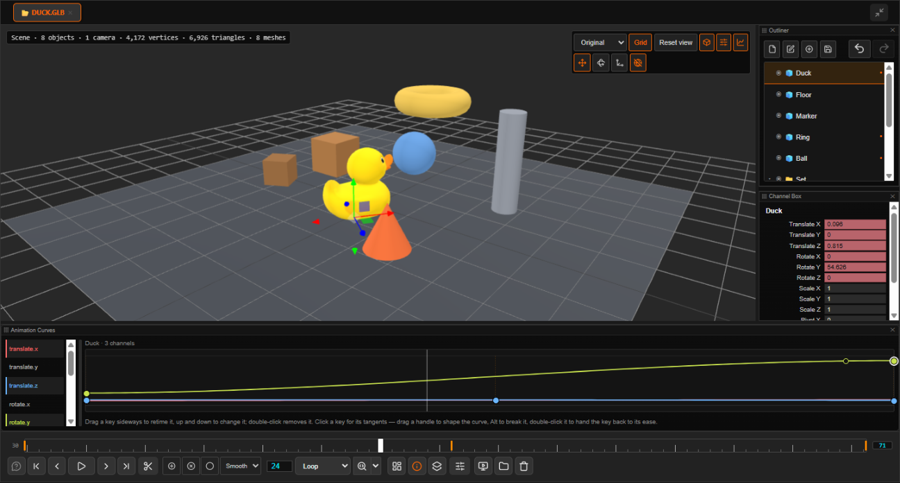
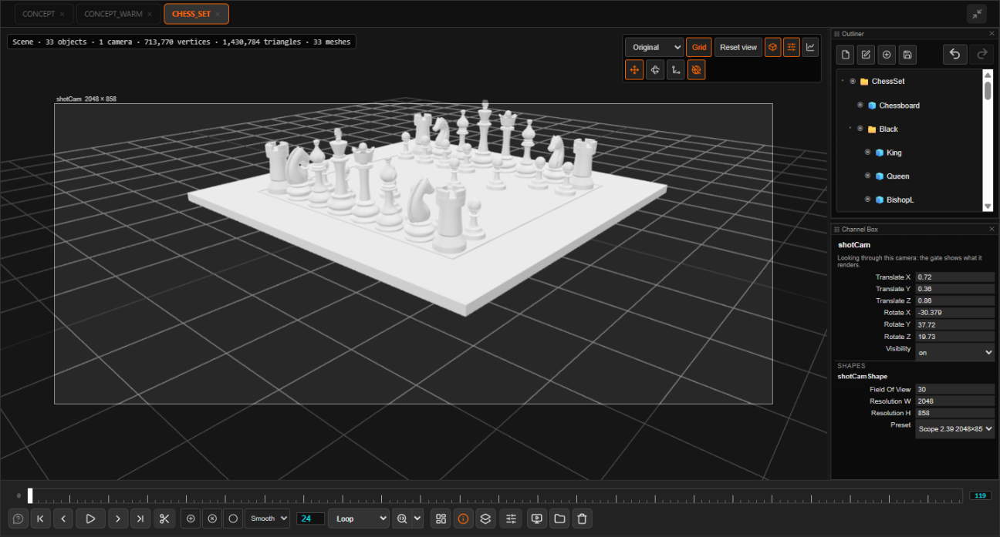
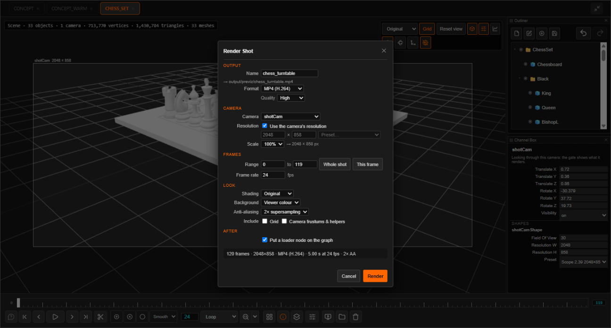

# ComfyUI Image Viewer — bEpic Viewer

An advanced image viewer panel for [ComfyUI](https://github.com/comfyanonymous/ComfyUI) with inspection tools, playback controls, image comparison, its own parameters panel — and a 3D previz tool for laying out, animating and rendering shots.

---



## Core Features

### Viewing

- send any image, mask, video or 3D model to the viewer with the **bEpic Send To Image Viewer** node — or right-click any node and choose **Send to Image Viewer**
- view the outputs of several nodes at once, each in its own tab
- zoom and pan; undock the viewer into its own browser window for a second monitor
- each tab keeps a history of up to 20 snapshots automatically
- play image sequences and videos with configurable FPS, and loop a sub-range of the timeline
- split-screen comparison with a draggable divider — shift-click two tabs or two history items to compare them
- real-time exposure (−4 EV to +4 EV) and isolation of the **Red**, **Green** or **Blue** channel

### Working with the graph

- a **parameters panel** shows the widgets of the node selected in the graph — lock it to one node, or change a value on every selected node at once
- **save to output** from the send node: PNG, EXR, TIFF, JPG, DPX, MP4, MOV, WebM, with frame-numbered image sequences (`shot.1001.png`) for a VFX pipeline
- what the node writes is **reported to ComfyUI like a save node's output**, so it shows up in the queue history, the Assets panel, and to scripts and agents reading them
- drag a history thumbnail, a file or the frame on screen onto the graph to get a loader node holding it
- **Roto** and **SAM3** tools draw mattes and point / box prompts right in the viewer, onto nodes that feed them to the workflow

### The interface

- **dockable panels** — history, file browser, parameters, and the 3D panels — on either side of the picture or along the bottom, stacked and resized with splitters, arrangement remembered
- a **file browser** over ComfyUI's folders (and any you allow): every file listed, wildcard and kind filters, previews
- every function has a **hotkey command** you can rebind in *Settings → Keybinding*

---

## 3D Models and Previz



- view **GLB, glTF, FBX, OBJ, STL, PLY** and **USD** files, and save meshes the way ComfyUI's Save 3D Model does
- every 3D tab is a **previz scene**: models, primitive shapes, groups and cameras, laid out in a Maya-style **Outliner** (drag to reorder and reparent — items keep their place in the world — double-click to rename) and edited in a **Channel Box**
- move, rotate and scale with a gizmo, around a pivot you can move; **Freeze Transformations**; tumble around the object under the cursor, Maya-style (<kbd>Alt</kbd> + mouse)
- keyframe everything on the viewer's timeline and shape the motion in a **curve editor** with tangents
- cameras have a **resolution** and show a **resolution gate** when you look through them
- **render the shot** back into the workflow from a render dialog — any camera, frame range and size, MP4 / MOV / WebM / PNG, shading, transparent backgrounds, supersampled anti-aliasing — and it lands on the graph as a loader node
- exchange whole shots as **USD** stages with other applications

<p>


</p>

---

**Full documentation:** [docs/index.md](docs/index.md) — every panel, tool, node and hotkey.

---

## Installation

### Method 1 — ComfyUI Manager (recommended)
1. Open the **ComfyUI Manager** panel inside ComfyUI.
2. Search for **ComfyUI-ImageViewer** and click **Install**.
3. Restart ComfyUI.

### Method 2 — Manual installation
1. Navigate to your ComfyUI custom nodes folder:
   ```
   ComfyUI/custom_nodes/
   ```
2. Clone or copy this repository into that folder:
   ```bash
   git clone https://github.com/szprivate/ComfyUI-ImageViewer.git
   ```
3. Install Python dependencies (Pillow, numpy, and `usd-core` for the USD support):
   ```bash
   pip install -r ComfyUI-ImageViewer/requirements.txt
   ```
4. Restart ComfyUI.

After installation a **"Toggle bEpic Image Viewer"** button appears in the ComfyUI action bar. Click it to show or hide the viewer panel.

Video encoding (MP4 / MOV / WebM saving and previz renders) needs `imageio-ffmpeg` — VideoHelperSuite installs it; otherwise `pip install imageio-ffmpeg`.

---

## Usage

1. Add **bEpic Send To Image Viewer** node to your workflow.
2. Connect image outputs to it.
3. Click **"Toggle bEpic Image Viewer"** in the top bar to open the panel.
4. Run the workflow — generated images appear in the viewer automatically.
5. Hover the viewer and press <kbd>?</kbd> for the hotkeys.

For 3D: open a model from the file browser or drop one onto the viewer — or add a **bEpic 3D Scene (Previz)** node and press **Open in Image Viewer** on it to build a shot and render it back into the workflow. See [3D Models & Previz](docs/sub/models-3d.md).

---

## License, contributing

Copyright © 2026 bEpic GmbH / Sebastian Zilius

**Free for personal and non-commercial use.**

- ✅ Personal projects, research, education, and non-commercial creative work
- ✅ Feel free to create your own fork and make updates - this is OpenSource, happy to include your Pull Requests if they're good!

- ❌ Commercial use of any kind is **prohibited** without explicit written permission from the author

Redistribution, modification, and use in source and binary forms are permitted **for non-commercial purposes only**, provided that this copyright notice is retained in all copies or substantial portions of the software.

For commercial licensing enquiries, contact the repository owner.

THIS SOFTWARE IS PROVIDED "AS IS", WITHOUT WARRANTY OF ANY KIND, EXPRESS OR IMPLIED.
