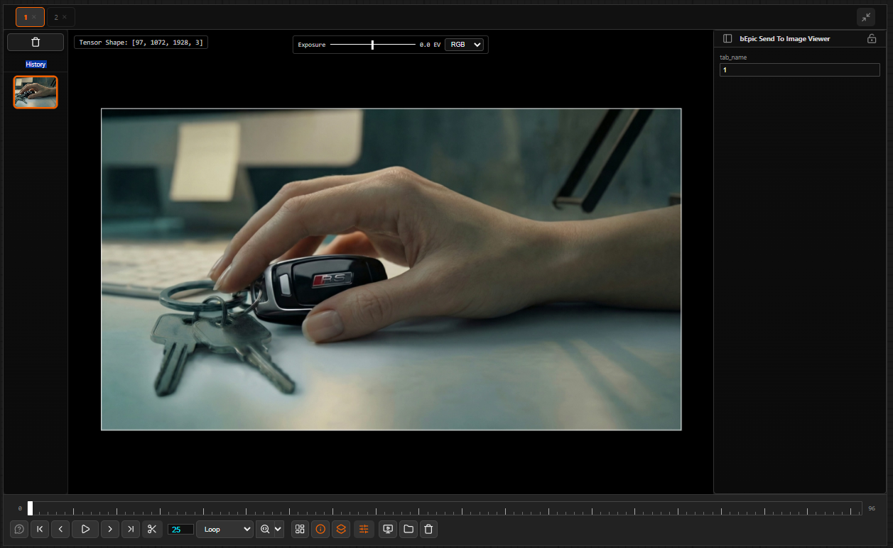

# bEpic ImageViewer — Documentation

A professional floating image viewer for ComfyUI — multi-tab, history snapshots, side-by-side comparison, playback timeline, exposure/channel controls, and a live parameter panel.

---

## What is bEpic ImageViewer?

bEpic ImageViewer is a custom node extension for [ComfyUI](https://github.com/comfyanonymous/ComfyUI) that replaces the built-in preview with a powerful, dockable viewer panel. Instead of hunting through tiny preview nodes scattered across your canvas, every output is routed here — organised into named tabs, kept in a scrollable history, and ready for detailed inspection.

## Key Features

| Feature | Description |
|---|---|
| **Multi-Tab Organisation** | Route different outputs to named tabs. Reorder by drag, close with ×. |
| **History Snapshots** | Up to 20 generations per tab shown as thumbnails. Navigate with ↑ ↓. |
| **Image Comparison** | Vertical or horizontal split with a draggable divider. Compare tabs or history items. |
| **Playback & Timeline** | Play image sequences, set FPS, loop modes, scrub frames, select sub-ranges. |
| **Exposure & Channels** | ±4 EV exposure slider. Isolate R/G/B channels for data inspection. |
| **Parameter Panel** | Live widget values for the selected ComfyUI node — editable in the viewer. |
| **File Browser** | Open any folder of images as a new viewer tab. |
| **Undock / Multi-Monitor** | Pop the viewer into its own browser window for a second screen. |

## How It Works

The extension registers a floating panel (`<bepic-viewer-panel>`) using the Web Components API with Shadow DOM — so its styles never conflict with ComfyUI's own UI. On the backend, a **bEpic Send To Image Viewer** node converts image tensors to PNG, saves them to ComfyUI's temp directory, and pushes a `bepic.viewer.update` WebSocket message to the frontend. The viewer picks it up and populates the relevant tab automatically.

All viewer state — open tabs, history stacks, panel positions, layouts — is persisted to `localStorage` so your workspace survives page reloads.

## Quick Start

1. Install the extension via ComfyUI Manager or git clone into `custom_nodes/`. See [Installation & Setup](sub/getting-started.md).
2. Click **Toggle bEpic Image Viewer** in the ComfyUI action bar to open the panel.
3. Add a **bEpic Send To Image Viewer** node to your workflow and connect any image output to its `input` pin.
4. Set an optional `tab_name` on the node, then run your workflow. The image appears in the viewer instantly.
5. Hover the panel and press `?` for the built-in hotkey overlay at any time.

## Documentation

| Page | What you will learn |
|---|---|
| [Viewer Interface](sub/interface.md) | Anatomy of every panel and control |
| [Tabs & History](sub/tabs-history.md) | Creating tabs, navigating history, context menu |
| [Image Comparison](sub/comparison.md) | Split view, contact sheet, comparing history snapshots |
| [Playback Controls](sub/playback.md) | Playing sequences, timeline scrubbing, loop modes, sub-range |
| [Channels & Exposure](sub/channels-exposure.md) | Exposure slider, RGB isolation, interactive E-drag |
| [Parameter Panel](sub/params-panel.md) | Live node params, lock, dock, resize |
| [Other Features](sub/other.md) | File browser, undocking, layouts, cache management |
| [Node Reference](sub/nodes.md) | Full input/output spec for the bEpicSendToViewer node |
| [Keyboard Shortcuts](sub/hotkeys.md) | Complete hotkey reference |

