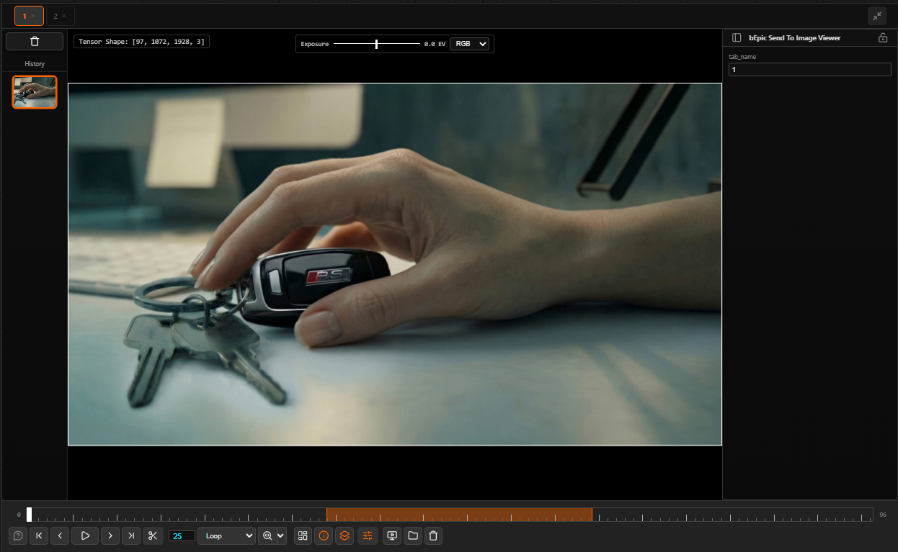

# Channels & Exposure

The viewer's exposure and channel controls let you inspect image data the way a VFX artist would — adjusting brightness non-destructively and isolating individual colour channels to spot artefacts, clipping, or bias.

← [Back to index](../index.md)

---


*The exposure bar centred at the top of the viewport — slider, EV readout, and channel dropdown.*

## Exposure Control

The exposure slider ranges from **−4 EV** to **+4 EV** and adjusts display brightness using a CSS `brightness()` filter — the underlying image data is **never modified**.
```

Use it to:

- Check for **clipped highlights** — push exposure up and look for blown-out white patches.
- Inspect **shadow detail** — boost exposure to see into dark areas.
- Confirm near-black regions carry actual data (not crushed blacks).

### Using the Slider

Drag the slider knob or click on the track to set an EV value. The readout on the right updates in real time (e.g. `+1.5 EV`).

### Interactive E-Drag

Hold <kbd>E</kbd> while dragging the mouse **horizontally** anywhere over the viewer to scrub exposure interactively. Release <kbd>E</kbd> to lock the value in place.

### Resetting Exposure

**Right-click** the exposure control (slider or label) to instantly reset to **0.0 EV**.

---

## Channel Isolation

The channel selector dropdown (to the right of the EV readout) switches the viewport between four display modes. Channels are extracted using CSS SVG matrix filters — non-destructive and instant.

| Mode | Keyboard | What you see |
|---|---|---|
| **RGB** | Press the active channel key again to return | Full colour composite (normal display) |
| **R** — Red | <kbd>R</kbd> | Red channel as greyscale — brighter = more red |
| **G** — Green | <kbd>G</kbd> | Green channel as greyscale — brighter = more green |
| **B** — Blue | <kbd>B</kbd> | Blue channel as greyscale — brighter = more blue |

---

## Practical Inspection Workflows

### Checking for Colour Bias

Switch to R, G, B in turn and look for areas that are brighter than expected in one channel. An overall green cast, for example, will show the G channel uniformly lighter than R and B.

### Verifying Alpha / Mask Data

If you pass a grayscale mask tensor to the viewer (shape `[1, H, W, 1]` or `[1, H, W]`), the viewer detects it and converts it to a displayable format. Use channel isolation to confirm mask coverage is correct.

### Detecting Highlight Clipping

1. Drag exposure to **+2 EV or higher**.
2. Look for areas that become pure white — these are already clipped at 1.0 in the source.
3. If you see extensive pure-white patches at +2 EV, your sampler may be over-saturating highlights.

---

← [Playback Controls](playback.md) | Next: [Parameter Panel](params-panel.md)
