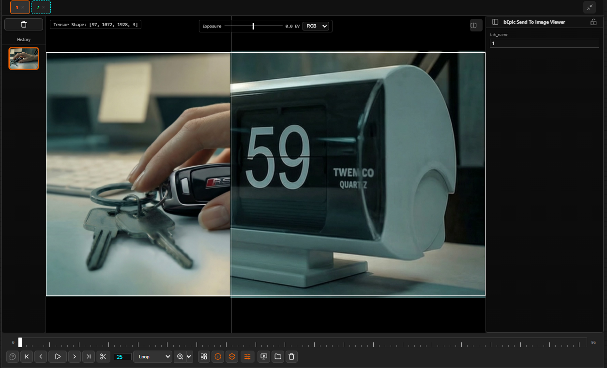

# Image Comparison

bEpic ImageViewer has a powerful split-view comparison mode that works across tabs, within a single tab's history, and in multiple orientation modes.

← [Back to index](../index.md)

---

## Starting a Comparison

### Compare Two Tabs

1. Make sure both tabs you want to compare are open and contain images.
2. <kbd>Shift</kbd>+click the **first** tab to mark it as the base image (a cyan highlight appears on the tab).
3. <kbd>Shift</kbd>+click the **second** tab — the viewer enters split-view immediately.

### Compare Two History Snapshots

1. Navigate to the tab whose history you want to compare.
2. <kbd>Shift</kbd>+click one thumbnail in the history strip to select it as base.
3. <kbd>Shift</kbd>+click another thumbnail — split-view opens.

> [!TIP]
> Press <kbd>C</kbd> while hovering the viewer to toggle comparison mode on/off without losing your comparison pair selection.

---

## The Compare Divider

In split-view, a bright white divider line separates the two images. Drag it left/right (vertical split) or up/down (horizontal split) to reveal more of either image. The divider position is remembered per session.

---

## Orientation Modes

The **Rotate** button in the toolbar cycles through three modes:

| Mode | Description |
|---|---|
| **Vertical Split** (default) | Left/right division — classic A/B wipe. Drag divider horizontally. |
| **Horizontal Split** | Top/bottom division. Drag divider vertically. |
| **Contact Sheet** | Both images stacked vertically in full — no divider, scroll to compare. |

---

## Exiting Comparison Mode

Press <kbd>C</kbd> while hovering the viewer, or click a tab without holding <kbd>Shift</kbd>. The viewer returns to single-image display on the last active tab.

---

## Comparison with Playback

Comparison mode works simultaneously with the playback timeline — both the base and compare image update as you scrub or play frames. This is useful for comparing animated sequences frame-by-frame at the same timestamp.

> [!NOTE]
> When comparing two tabs with different frame counts, the shorter sequence will loop or hold on its last frame depending on the loop mode setting.

---

← [Tabs & History](tabs-history.md) | Next: [Playback Controls](playback.md)
