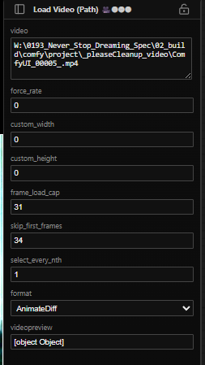

# Parameter Panel

← [Back to index](../index.md)

---

The parameter panel displays the parameters of your selected node (s).

If no node is selected on the canvas, the panel falls back to showing the source node of the active viewer tab (i.e. the bEpicSendToViewer node that generated the current image).

## Multi-Node Selection

In ComfyUI, you can <kbd>Shift</kbd>+click multiple nodes to select them simultaneously. The parameter panel will display the widgets of **all selected nodes** stacked vertically — each group prefixed with the node's title. 

## Locking the Panel

By default the panel tracks whatever node is selected. Click the **padlock** icon in the panel's header to lock it to the currently displayed node. While locked:

- Selecting other nodes on the canvas will **not** update the panel.
- The padlock icon changes to a closed-lock indicator.
- Click the padlock again to unlock and resume tracking canvas selection.

---

← [Channels & Exposure](channels-exposure.md) | Next: [Other Features](other.md)
