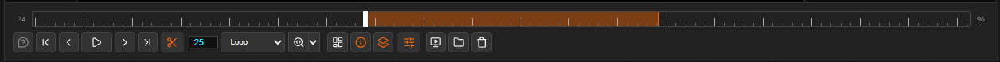

# Playback Controls

The viewer treats every tab as a potential sequence. Use the timeline and playback controls to review image batches, frame-by-frame outputs, and folder-loaded sequences at any speed.

← [Back to index](../index.md)

---

---

## The Timeline

The timeline slider stretches across most of the playback toolbar. It shows major and minor tick marks as visual reference.

### Scrubbing

Click anywhere on the timeline to jump to that frame. Click and drag to scrub through frames interactively — the fastest way to review a long sequence.

### Selecting a Playback Sub-Range

Hold <kbd>Ctrl</kbd> while dragging on the timeline to define a sub-range. The selected region is highlighted in orange. Playback will loop only within this range.

To clear the sub-range and return to full-sequence playback, <kbd>Ctrl</kbd>+click outside the selection.

---

## FPS Control

The **FPS** input box sets the playback speed (default: `25`). Click the number and type a new value, or scroll the mouse wheel over it.

---

## Loop Modes

| Mode | Behaviour |
|---|---|
| **Loop** | Wraps back to the first frame and continues playing. |
| **Ping-Pong** | Reverses direction at each end — plays forwards then backwards continuously. |
| **Once** | Stops at the last frame and pauses. |

---

← [Image Comparison](comparison.md) | Next: [Channels & Exposure](channels-exposure.md)
