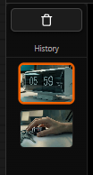

# Tabs & History

Learn how the viewer organises multiple image sources into tabs and maintains an automatic per-tab history of every generation.

← [Back to index](../index.md)

---

## The Tab System

Every image source gets its own tab. Tabs are created automatically when:

- A **bEpic Send To Image Viewer** node runs — the tab name is set by the node's `tab_name` field (defaults to the node's unique ID if left blank).
- You **Open a Folder** via the file-browser button — a `folder_*` tab is created for the images in that directory.

### Naming Tabs

Give each bEpicSendToViewer node a meaningful `tab_name` — for example `vae_decode`, `upscaled`, `mask`. This label becomes the tab's title in the viewer.

> [!TIP]
> Use a consistent naming convention across projects (e.g. stage names) so you can switch between tabs with number keys without having to read the labels.

### Tab Operations

| Action | How |
|---|---|
| Switch tab | Click the tab, or press <kbd>1</kbd>–<kbd>9</kbd> |
| Reorder tabs | Drag a tab left/right along the tab bar |
| Close tab | Click the **×** on the tab |
| Select for comparison | <kbd>Shift</kbd>+click (see [Image Comparison](comparison.md)) |

---

## History Snapshots

Every time new images arrive in a tab, they are automatically saved as a snapshot in that tab's **history**. The history strip is the vertical thumbnail column on the left side of the viewport.

### Navigating History

With the viewer hovered, press <kbd>↑</kbd> and <kbd>↓</kbd> to move through snapshots. The most-recent snapshot is at the top. Alternatively, click any thumbnail to jump directly to it.

### Snapshot Limit

Each tab stores up to **20 snapshots**. Once the limit is reached, the oldest snapshot is removed when a new one arrives. The history is persisted to `localStorage`, so it survives page reloads.

### History Context Menu

Right-click any thumbnail to open the context menu:

| Menu Item | Effect |
|---|---|
| Copy Image Path | Copies the absolute file path of that snapshot to the clipboard |
| Remove from History | Deletes that snapshot from the strip (does not delete the file on disk) |

### Clearing All History

The **Clear Cache** button in the playback toolbar deletes all temporary bEpic files and wipes every tab's history. A confirmation dialog prevents accidental clearing.

---

## Comparing History Snapshots

You can compare any two snapshots side-by-side without leaving the tab:

1. <kbd>Shift</kbd>+click the **first** snapshot thumbnail to select it as the base.
2. <kbd>Shift</kbd>+click a **second** thumbnail to open the comparison view.
3. A split-view appears with the two snapshots. Drag the divider to explore differences.
4. Press <kbd>C</kbd> or click a tab normally to exit comparison mode.

See [Image Comparison](comparison.md) for full split-view controls.

## Duplicate Detection

The viewer computes a fast signature for each incoming snapshot. If the same image arrives again (e.g. you re-run a workflow without changing seeds), it is not added to the history a second time — avoiding clutter from identical regenerations.

---

← [Viewer Interface](interface.md) | Next: [Image Comparison](comparison.md)
