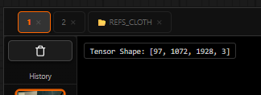
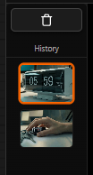
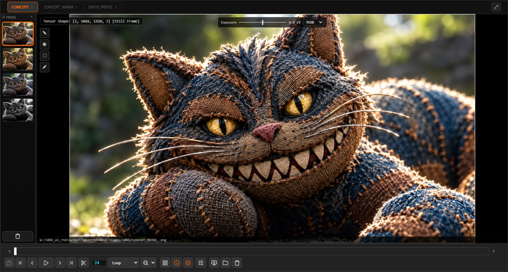

# Tabs & History

← [Back to index](../index.md)

---

## The Tab System

> [!NOTE]
> History thumbnails size themselves to the panel. Widen the rail and they grow with it; widen it far enough and they wrap into a grid of two, three or more across rather than becoming one enormous column. Drag the panel by its title bar to put it wherever suits — see [Docking Panels](interface.md#docking-panels).

Every image source gets its own tab. Tabs are created automatically when:

- A **bEpic Send To Image Viewer** node runs — the tab name is set by the node's `tab_name` field (defaults to the node's unique ID if left blank).
- You open files from the **File Browser** panel, or drag them onto the viewport from it — a `folder_*` tab is created, holding a folder's images as one sequence and each video on its own. See [File Browser](other.md#file-browser).
- You right-click a node on the canvas and choose **Send to Image Viewer** — a loader opens its file directly, any other image-producing node runs its branch first. See [Send to Image Viewer](other.md#send-to-image-viewer).

### Naming Tabs

Give each bEpicSendToViewer node a meaningful `tab_name` — for example `vae_decode`, `upscaled`, `mask`. This label becomes the tab's title in the viewer.

> [!TIP]
> Use a consistent naming convention across projects (e.g. stage names) so you can switch between tabs with number keys without having to read the labels.

### Tab Operations

| Action | How |
|---|---|
| Switch tab | Click the tab, or press <kbd>1</kbd>–<kbd>9</kbd> |
| Reorder tabs | Drag a tab left/right along the tab bar |
| Close tab | Click the **×** on the tab |
| Select for comparison | <kbd>Shift</kbd>+click (see [Image Comparison](comparison.md)) |

---

## History Snapshots

Every time new images arrive in a tab, they are automatically saved as a snapshot in that tab's **history**. The history strip is the vertical thumbnail column on the left side of the viewport.

### Navigating History

With the viewer hovered, press <kbd>↑</kbd> and <kbd>↓</kbd> to move through snapshots. The most-recent snapshot is at the top. Alternatively, click any thumbnail to jump directly to it.

### Snapshot Limit

Each tab stores up to **20 snapshots**. Once the limit is reached, the oldest snapshot is removed when a new one arrives. The history is persisted to `localStorage`, so it survives page reloads.

### Selecting Several Snapshots

| Action | How |
|---|---|
| Add a snapshot to the selection | <kbd>Ctrl</kbd>+click (<kbd>Cmd</kbd> on Mac) |
| Select a range | <kbd>Ctrl</kbd>+<kbd>Shift</kbd>+click |
| Clear the selection | Click any thumbnail normally |

Selected thumbnails carry a blue ring and a dot in the corner. The selection belongs to one tab and is not persisted — it is dropped whenever the strip shifts underneath it, such as when a new snapshot arrives from a prune.

<kbd>Ctrl</kbd> rather than plain <kbd>Shift</kbd>, because <kbd>Shift</kbd>+click is [snapshot comparison](comparison.md) and that is the more valuable gesture. A snapshot can be in the selection *and* pinned for comparison at the same time.

Once several are selected:

- **Drag any one of them** onto the node graph and the whole selection is dropped, one loader node per snapshot, cascaded so none lands hidden behind another. Dragging a thumbnail that is *not* in the selection drags just that one and leaves the selection alone.
- **Press <kbd>Shift</kbd>+<kbd>Delete</kbd>** (with the viewer hovered) or use the context menu to remove them all in one go.

### Deleting Snapshots

With the viewer hovered and the history strip open, <kbd>Shift</kbd>+<kbd>Delete</kbd> removes the selected snapshots — or, when nothing is selected, the snapshot currently open in the viewer. Nothing on disk is touched. When there is nothing to delete the key is left alone.

A plain <kbd>Delete</kbd> is not used, so it always reaches ComfyUI's own delete-selected-nodes. The default binding only fires while the viewer is hovered. To change it, or to make it work with the cursor elsewhere, assign your own combo in **Settings → Keybinding** (*bEpic Viewer: Delete Selected History Snapshots*).

### History Context Menu

Right-click any thumbnail to open the context menu:

| Menu Item | Effect |
|---|---|
| Copy Image Path | Copies the absolute file path of that snapshot to the clipboard — paste it into a file manager, or into the [File Browser](other.md#file-browser)'s path field to go there |
| Remove from History | Deletes that snapshot from the strip (does not delete the file on disk) |
| Remove *n* from History | Shown instead when you right-click inside a selection — removes all of them |

Thumbnails in the strip load lazily, so only the ones scrolled into view hold a decoded image.

### Snapshots Whose Files Are Gone

History is persisted, so it outlives the files it points at — a temp directory that was cleaned out, an output folder belonging to a different machine or a different ComfyUI install. Those snapshots are dropped from the strip silently, rather than sitting there as broken thumbnails.

An entry only goes when the server confirms it: the viewer asks whether the files are still readable, and asks a second time before removing anything. So a snapshot that arrives a moment before its file finishes writing is kept, and a server that is restarting or unreachable never costs you history. A sequence that lost only *some* of its frames still opens, so it stays too.

> [!NOTE]
> "Readable" means readable *by this server*. A file that exists but sits outside ComfyUI's `output` and `temp` directories counts as gone, because that is what the viewer's image route will say about it. Only the file on disk is left alone — pruning never deletes anything.

### Clearing All History

The **Clear Cache** button in the playback toolbar deletes all temporary bEpic files and wipes every tab's history. A confirmation dialog prevents accidental clearing.

---

## Comparing History Snapshots

You can compare any two snapshots side-by-side without leaving the tab:

1. <kbd>Shift</kbd>+click the **first** snapshot thumbnail to select it as the base.
2. <kbd>Shift</kbd>+click a **second** thumbnail to open the comparison view.
3. A split-view appears with the two snapshots. Drag the divider to explore differences.
4. Press <kbd>C</kbd> or click a tab normally to exit comparison mode.

See [Image Comparison](comparison.md) for full split-view controls.

## Duplicate Detection

The viewer computes a fast signature for each incoming snapshot. If the same image arrives again (e.g. you re-run a workflow without changing seeds), it is not added to the history a second time — avoiding clutter from identical regenerations.

---

← [Viewer Interface](interface.md) | Next: [Image Comparison](comparison.md)
