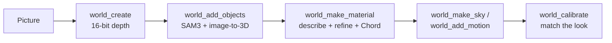

# bEpic Worlds — Usage Guide

Updated 2026-09-24

Ask agentY for a world from a picture; it builds it in ComfyUI and opens it in the bEpic viewer, where you walk it, pin notes, and have the agent act on them.

## Setup

Three pieces, all on master/main and pushed; restart ComfyUI once after pulling so the pack's routes and nodes load.

| Piece | Where | What it does |
| --- | --- | --- |
| bEpic Image Viewer | `custom_nodes/ComfyUI-ImageViewer` | Shows worlds: walk, reference overlay, Match, notes |
| ComfyUI-bEpicWorlds | `custom_nodes/ComfyUI-bEpicWorlds` | Builds and stores worlds; `/bepic_worlds/*` routes; slot workflows in `slots/` |
| agentY World Builder | `agentY` repo | Specialist the orchestrator calls with `run_world_builder` |

Check it is live: `http://127.0.0.1:8188/bepic_worlds/info` answers with JSON (a 404 means ComfyUI hasn't loaded the pack yet).

The default workflows need these models: Depth Anything V2 Large, SAM 3.1, Hunyuan3D 2.1, Z-Image Turbo, Chord + 4x-ClearRealityV1, RMBG-2.0, Wan 2.2 Fun Inpaint 14B with the lightx2v 4-step LoRAs. The World Builder uses the research/assembly model tier unless `pipeline.world_builder` is set in agentY's settings.

## Making a world

Drop the reference picture into agentY's chat and say what you want; the orchestrator hands the job to the World Builder, which runs everything in ComfyUI and opens the result in the viewer.

Things to say:

- "Make a walkable world from this photo, with the real cars in it."
- "Give the floor a proper material and add a sky."
- "Put three wooden benches along the path."
- "Make the water move."
- "Use Meshy for the cars this time." (paid API credits)

What the World Builder does, in order:

The first object kind with a standard height (cars, people, doors) also fixes the camera tilt, so everything comes out the right size; that step rebuilds the world, which is why objects come first. A full garage run takes about 10 minutes: depth seconds, each object kind 1–2 min, each material 2 min, a motion loop 3–4 min.

| Tool | Makes | Typical time |
| --- | --- | --- |
| `world_create` | The world: terrain, sky, light, the picture in 3D (hero view) | 20 s |
| `world_add_objects` | Copies of an object in the picture, where it shows them | 1–2 min |
| `world_add_props` | Made-up objects from words, placed or scattered | 2 min |
| `world_make_material` | Tileable PBR ground or ceiling, from the picture or from words | 2 min |
| `world_make_sky` | A generated 360° sky (outdoors) | 15–90 s |
| `world_add_motion` | A looping movement of part of the picture (water, leaves, a flag) | 3–4 min |
| `world_calibrate` | Exposure, fill, sun, fog matched to the picture | 30 s, in the viewer |

## Displaying a world

Every new or edited version opens by itself in the bEpic viewer as a **World: &lt;name&gt;** tab; the tab survives reloads. To bring one back, ask the agent to open it ("open the lake world", or version 3 of it), or POST `{"name": "lake"}` to `/bepic_worlds/open`.

The tab is a previz scene: orbit it like any 3D scene, pick items in the outliner, and tweak them in the channel box. The toolbar has three world buttons:

| Button | Hotkey | Does |
| --- | --- | --- |
| Walk | Shift+J | First person at eye height; click to look, W A S D to move, Shift to run, F to pin a note, Esc to stop |
| Match | — | Matches the look to the picture by measurement and saves it as a new version |
| Note | Shift+N | Pin a note on a spot (see Reviewing) |

The world is judged best from the **Reference** camera (`refcam`): look through it and the picture lies over the view for comparison. The **hero view** is the picture itself pushed into 3D by its depth map; it looks right from near that camera and stretches as you walk away from it. Ambient motion plays on the hero view, and only while the browser tab is visible (Chrome loads no video in a hidden tab).

## Reviewing

Review by pinning notes where things are wrong, then asking the agent to work through them; each round is a new version, and nothing is ever lost.

1. Walk or orbit the world and find what's off.
2. Pin a note: press **F** while walking (at the spot you look at), or **Note** / Shift+N and click the spot. Type the note, e.g. "fewer trees here", "floor too shiny" or "a bench here". Each note keeps the spot, your view and a snapshot of what you saw, and shows as a numbered pin.
3. Tell agentY: "Look at my notes on the lake world." The World Builder reads each note, looks at its snapshot, makes one edit for the round and replies on every note it dealt with.
4. The tab refreshes to the new version; pins of resolved notes disappear, and open ones stay.

Versions: every create, edit, rebuild, match and feedback round saves a new version with a note saying what changed. To go back, ask for it ("revert the lake world to version 3"); a revert is itself a new version, so it can be undone too. Worlds live in `output/worlds/<name>/`, with every version in `versions/`.

Changes you make by hand in the channel box stay in that viewer tab only; say them to the agent (or pin them as notes) if they should reach the world.

## Changing how steps are done

Every generative step is a ComfyUI workflow ("slot"), and you can swap one by asking, e.g. "use SHARP depth" or "use Meshy for 3D"; the choice holds for all worlds until changed back.

| Slot | Default | Alternatives |
| --- | --- | --- |
| depth | Depth Anything V2, 16-bit | SHARP metric depth |
| segment | SAM 3.1 | — |
| image_to_3d | Hunyuan3D 2.1 (textured from the picture) | Meshy with PBR (API credits) |
| texture_refine | Z-Image Turbo img2img | — |
| texture_generate | Z-Image Turbo | — |
| material | 4x upscale + Chord | — |
| sky | Z-Image panorama | Qwen-Image 360 (needs its LoRA) |
| object_image | Z-Image + RMBG-2.0 | — |
| motion | Wan 2.2 Fun Inpaint loop | — |

Any workflow can fill a slot, including one of your own or a template from agentY's library. Title its nodes `IN:image`, `IN:prompt.text`, `IN:seed.seed` … for inputs and `OUT:mesh`, `OUT:texture` … on the save nodes. The pack's own are in `ComfyUI-bEpicWorlds/slots/`, and `SCHEMA.md` there lists each slot's inputs and outputs. Textures come out tileable by default: diffusion runs through *bEpic Seamless Model* and *bEpic Seamless VAE Decode*, and a workflow of your own for a texture slot should use them too.

## Tips and current limits

- **Pictures that work best**: eye-level photos with a clear floor or ground, and objects standing on it. Aerials, close-ups and heavy wide-angle distortion build poorly.
- **Wrong sizes** (a car 0.9 m tall) mean the camera tilt is off: ask the agent to fit the camera from the cars; this rebuilds the world, so objects and materials are added again after.
- **Rebuilds drop additions**: objects, materials, sky and motion added since are not carried over, so the agent rebuilds first and adds after.
- **Generated objects** only know the side the picture shows; their far side is a colour blur. Meshy gives fully textured objects, at a cost.
- **Procedural vegetation** (the trees and rocks the builder scatters) is stylised low-poly; for real-looking trees, ask for props ("scatter 20 pine trees like the ones in the picture").
- **Match** needs the world open in a visible browser tab; the agent's calibrate step waits for it.
- **Not yet here**: the Qwen 360 sky LoRA isn't downloaded, and a world can only be built from one picture at a time.
